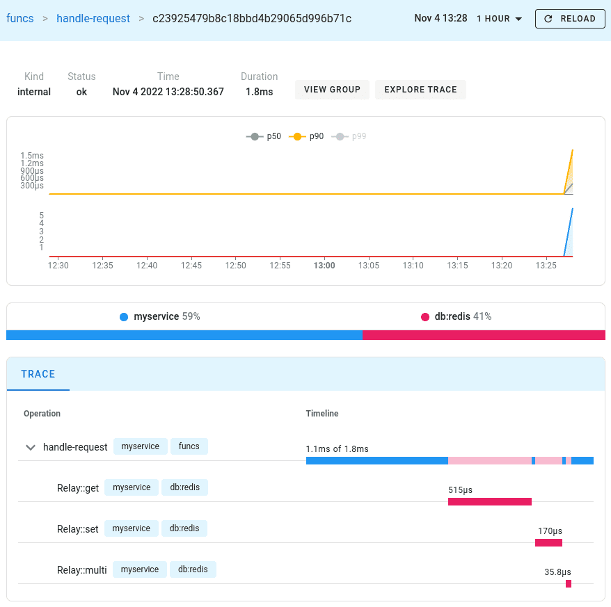
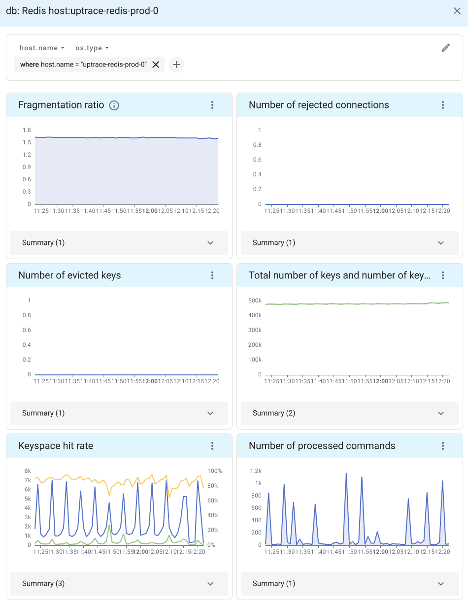

# Example for Relay OpenTelemetry instrumentation

This example demonstrates how to monitor Redis using [OpenTelemetry](https://opentelemetry.io/) and
[Uptrace](https://github.com/uptrace/uptrace). It requires Docker to start Redis Server and Uptrace.

**Step 1**. Download the example using Git:

```shell
git clone https://github.com/cachewerk/relay.git
cd example/opentelemetry
```

**Step 2**. Start the services using Docker:

```shell
docker-compose up -d
```

**Step 3**. Make sure Redis and Uptrace are running:

```shell
docker-compose logs redis
docker-compose logs uptrace
```

**Step 4**. Install dependencies and run the Relay example:

```shell
composer install
php main.php
```

**Step 5**. Follow the link from the CLI to view the trace:

```shell
php main.php
trace: http://localhost:14318/traces/ee029d8782242c8ed38b16d961093b35
```



You can also open Uptrace UI at [http://localhost:14318](http://localhost:14318) to view available
spans, logs, and metrics.

## Alerting and notifications

You can use Uptrace to monitor incoming spans and send notifications via email, Slack, Telegram, and more.

For example, the following rule creates an alert when Uptrace receives any spans from Redis (`where system = 'db:redis'`):

```yaml
alerting:
    rules:
        - name: Redis is working
          metrics:
              - uptrace.tracing.spans as $spans
          query:
              - $spans > 0
              - where system = 'db:redis'
          for: 5m
          annotations:
              summary: "Got {{ $values.spans }} spans from Redis"
```

Or you can create an alert only for failed operations (`status='error'`):

```yaml
alerting:
    rules:
        - name: Redis is failing
          metrics:
              - uptrace.tracing.spans as $spans
          query:
              - $spans{status='error'} > 10
              - where system = 'db:redis'
          for: 5m
```

See [Converting spans to metrics](https://uptrace.dev/get/span-metrics.html) for details.

## Redis monitoring

You can also [monitor Redis performance](https://uptrace.dev/opentelemetry/redis-monitoring.html) metrics By installing OpenTelemetry Collector.

[OpenTelemetry Collector](https://uptrace.dev/opentelemetry/collector.html) is an agent that pulls
telemetry data from systems you want to monitor and sends it to APM tools using the OpenTelemetry
protocol (OTLP).

When telemetry data reaches Uptrace, it automatically generates a Redis dashboard from a pre-defined template.


